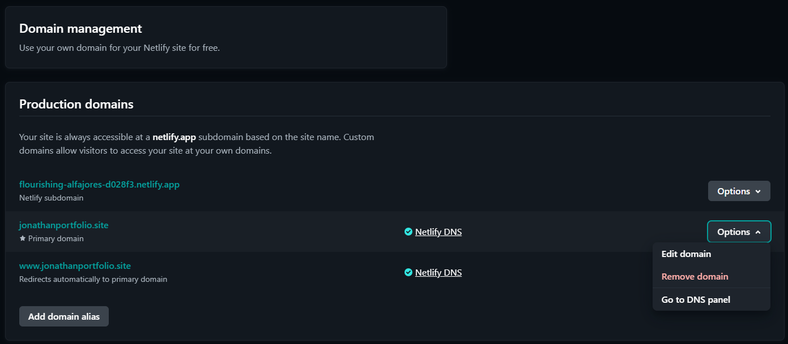

# BSU Garage

## BSU Garage : Where Your Car Gets the Care It Deserves

At BSU Garage, we understand that your car is more than just a mode of transportation; it's a reliable companion for your daily commute, weekend adventures, and everything in between. That's why we're dedicated to providing comprehensive car repair and maintenance services that keep your vehicle running smoothly, safely, and reliably for years to come.

Our website is your one-stop resource for everything car care related.

## About Us

Get to know the passionate team behind BSU Garage. We're a group of experienced and certified technicians who are driven by a shared commitment to excellence and customer satisfaction. Learn more about our values, our dedication to using top-of-the-line parts and technology, and our commitment to ongoing training to stay up-to-date on the latest automotive advancements.

## Services Offered: Explore the wide range of services we offer to address all your car's needs

- Engine System Repair: Our skilled technicians utilize advanced diagnostic tools and their extensive knowledge to identify and resolve even the most complex engine issues, ensuring optimal performance and fuel efficiency.
- Electrodiagnostics: We utilize cutting-edge technology to pinpoint electrical problems with precision, ensuring your car's electronic systems function flawlessly and safely.
- System Repair & Fix: Whether it's your brakes, steering, air conditioning, heating, or any other system experiencing issues, our team has the expertise to diagnose and repair the problem effectively.
- Suspension System Repair: We understand the importance of a well-maintained suspension system for a smooth and comfortable ride. Our technicians can diagnose and repair any issues with your suspension components, ensuring your car handles predictably and safely on any road.
- Car Maintenance: Regular maintenance is crucial for preventing problems and extending the lifespan of your vehicle. We offer a comprehensive range of maintenance services, including oil changes, tire rotations, filter replacements, fluid checks, and more.

## Car Repair Statistics

Gain valuable insights into common car repair issues and the importance of preventive maintenance. We believe in empowering our customers with knowledge so they can make informed decisions about their car care needs.

## Meet Our Team

Get acquainted with the talented and experienced individuals who make BSU Garage run. From our service advisors who listen attentively to your concerns to our certified technicians who possess the skills and expertise to address any automotive issue, you can be confident your car is in good hands.

## Customer Feedback

Read testimonials from our satisfied customers who have experienced the BSU Garage difference firsthand. Their positive experiences and genuine feedback speak volumes about the quality of service and commitment we provide.

## Appointment Form

Schedule your next service appointment online at your convenience. We offer flexible scheduling options and a comfortable waiting area with Wi-Fi and refreshments to make your experience as convenient and enjoyable as possible.

Beyond just repairs and service, BSU Garage is committed to building long-lasting relationships with our customers based on trust, transparency, and exceptional service. We believe in providing honest and fair advice, clear explanations of repair needs and solutions, and competitive pricing. We are committed to going the extra mile to ensure your experience at BSU Garage exceeds your expectations.

Visit BSU Garage today and discover why we are your trusted partner for all your car care needs! You can visit the website with this [link!](https://jonathanportfolio.site/)

## Deployment Process

### Log in or Sign Up for a Netlify Account

- First, go to the Netlify website: https://www.netlify.com/.
- Click the Log in button if you already have an account, or Sign Up to create a new one.
- In this guide, we will log in using a GitHub account.

### Import Your Project

- Before importing your project, ake sure the domain currently linked to your previous project is disconnected. This will free up the domain for use with the project you want to import.
- Open the previous project that is currently linked to your domain.
- Go to the "domain management" menu and select "remove domain" for the domain associated with that project.

  

- After the domain has been successfully deleted, return to the main menu and select the "sites" menu to import the project.
- Click the Add new site button and choose Import an existing project.

  

- You will be directed to a page to choose the source of your project deployment.
- Click the Deploy with GitHub button to connect your GitHub project to Netlify.

  

### Connect Your GitHub Account

- Enter your GitHub credentials if you haven't logged in to Netlify using GitHub.
- Select the RevoU-FSSE-4 repository since the milestone 1 project is located there.

  

### Make Sure Your Project is Public

- Before selecting the project you want to connect, make sure it is set to public so it can be accessed.
- If it is still private, you can change the project settings in GitHub.

### Deploy Your Project

- Select the project you want to connect and click the Deploy (project name) button.
- Wait until the project finishes deploying through Netlify.

### Check Your Website

- Once the project has been successfully deployed, click the deployed website page to check your website.

### Connecting the Domain to Netlify:

- Open your Netlify project: Access your project on the Netlify platform. Click "Set up a custom domain" and enter the domain name you purchased.

  

- Enter the existing domain name, which is "jonathanportfolio.site".
- Once the domain name is entered, the domain will be connected to your project. Your project will then be accessible using that domain name.
- You do not need to wait for DNS configuration like before because the domain name has already been used in a previous project. Therefore, the domain already has DNS configuration that has been set by Netlify.

  
